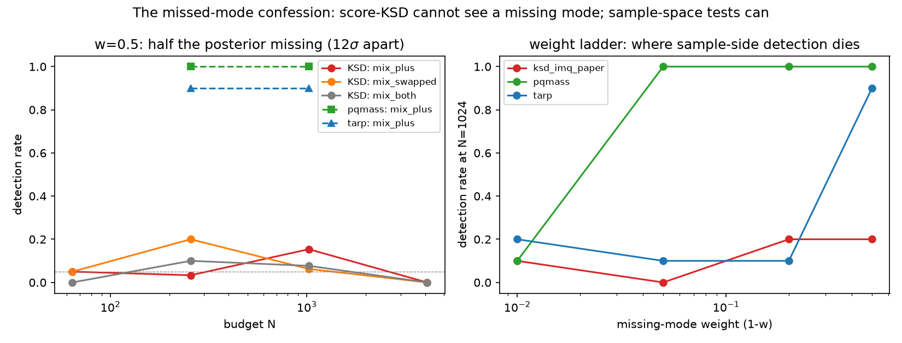

# tilt-audit

**An anatomy lab for steered diffusion inference.** Every sampler the field
actually uses for diffusion-based inverse problems — plug-in guidance (DPS),
reward-as-potential SMC, twisted SMC, terminal importance reweighting,
σ²-inflated annealed Langevin (Rémy et al. 2023), amortized conditional and
flow-matching models — run against targets where the posterior is **exactly
known**, so that scheme bias, score error, discretization, finite-N noise, and
model misspecification separate cleanly instead of blurring into "the samples
look fine." On top of the sampler anatomy sits an audit of everything that
claims to *detect* those failures: coverage tests, two-sample tests,
score-based certificates, budget-doubling checks — each forced through a null
gate (does it pass on a *perfect* sampler?) before it is allowed an opinion.

**The one-line summary of what came out:** the diagnostics a field trusts are
measurably powerful against the failures they were designed around, blind to
the ones they weren't — and two of them had real bugs that null-testing found
in a week ([tarp#14](https://github.com/Ciela-Institute/tarp/issues/14),
[mira-score#1](https://github.com/SammyS15/mira-score/issues/1), both with
fixes).

**Read the story:** the full plain-language writeup, with every number
measured and every plot element defined, is in
[`docs/explainer/certificate_explainer.html`](docs/explainer/certificate_explainer.html)
(open it in a browser).



## Headline measurements

| Finding | Where |
|---|---|
| DPS plug-in bias: 1.4–28× the oracle floor, monotone in steering strength, d-extensive — confirmed analytically to 1–3% by an independent stiff-ODE prediction | `results/t1_core.jsonl`, pilot handoff |
| The compensation trap: at score contamination ε\*≈−0.28, the temperature diagnostic reads *exactly* clean (γ\*=1.00) while true error is ~6× floor | `results/eps_star.jsonl` |
| Path-space certificates (importance-weight ledgers) die of weight degeneracy on trained networks — ESS ≡ 1.0 at every scale tested | `results/cert_*.jsonl` |
| Score-KSD (arXiv:2602.04189, reimplemented + calibrated): power 1.00 on scheme bias incl. the compensation trap; **1.00× null with half the posterior missing** (12σ-separated mode, any budget to 16,384); deployment (net score) false-certifies DPS at the paper's own settings | `results/ksd_trial.jsonl`, `figures/fig_ksd_power.png`, `fig_mixture.png`, `fig_wrongref.png` |
| MCMC gold standards on a nonlinear (lognormal) substrate cost ~74 s per 64² config, all gates green, scale to 128² | `scripts/run_gold.py` (draws regenerable; gates T-L1/2/3) |
| Transfer decay law: the linearized covariance correction that is *exact* on the Gaussian bench buys 11.6× / 2.8× / 1.1× at skewness 0.5 / 1 / 2; Rémy-style K-refinement stays ≤15× floor throughout | `results/transfer.jsonl`, `figures/fig_transfer.png`, `fig_remyK.png` |
| Budget-doubling convergence checks are one-directional: the alarm is trustworthy, the silence certifies nothing (slow convergence, biased samplers, and stuck modes all pass; for deterministic-ODE samplers the alarm never fires at all) | `results/k2k.jsonl`, `results/nfe2.jsonl` |

## The bench

The substrate is a Gaussian random field prior N(0, C) with a
cosmology-flavored spectrum, tilted by a quadratic reward
r(x) = −‖Ax−y‖²/(2s²); the target is the Wiener posterior with per-Fourier-mode
closed forms for the score, the diffusion marginals, the optimal twist, W₂,
KL, log Z, and every diagnostic's null. Three extensions keep the exactness
while removing the politeness: an exact two-component **mixture** arena
(missed-mode pathologies), a **nonlinear lognormal observation** with NUTS
gold standards (gated by the λ→0 limit, an independent closed-form
importance-sampling cross-check, and seed-independence tests), and trained
**score / flow-matching networks** for the deployment-realistic columns.

## Reproduce

```bash
git clone https://github.com/AndreasTersenov/tilt-audit && cd tilt-audit
uv venv && uv pip install -e . "jax[cuda12]" numpyro "arviz<1" pqm tarp
uv run pytest tests/test_gates.py        # the gate suite
uv run python scripts/gate_ksd.py        # T-K1: null-gates the KSD instrument
uv run python scripts/run_gold.py --n 32 --tilt mid --yseed 0 --linear-check
```

Every results row is append-only JSONL with config and provenance; every
figure regenerates from the JSONLs (`scripts/dawn_figures3.py`). GPU runs were
on single A100s; the gates and small grids run on CPU.

## Process

Every experiment was **pre-registered**: predictions frozen with confidence
levels in [`RESEARCH_LOG.md`](RESEARCH_LOG.md) and pushed publicly *before*
each night's first GPU job, then scored jointly afterwards — 15+ predictions
across four nights, including the misses and one public magnitude
self-correction. The as-it-happened record (including every mistake) is in
[`lab-notebook/`](lab-notebook/).

## Layout

`tilt_audit/` closed forms, samplers, metrics, certificates ·
`scripts/` grid runners, gates, batteries, figures ·
`tests/` the gate suite · `results/` JSONL data (sample banks and gold draws
are regenerable, not tracked) · `figures/` all regenerable ·
`docs/` frozen overnight plans, the explainer, upstream bug reports ·
`lab-notebook/` night logs and scored handoffs · `RESEARCH_LOG.md` the
prediction ledger.

## Citing

See [`CITATION.cff`](CITATION.cff). License: Apache-2.0.
