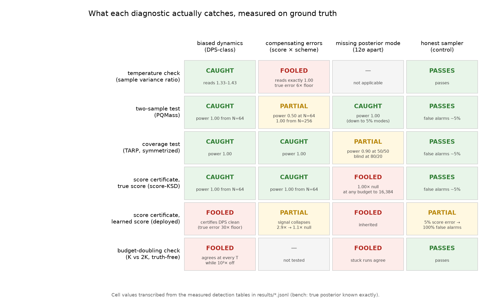

# tilt-audit

**The problem.** Generative models are increasingly used as priors inside
scientific inference. The recipe is to train a diffusion or flow model on
simulations, then *steer* it with data to draw samples from a posterior, over
dark-matter maps, medical images, or molecules. The steering methods in actual
use are approximations without guarantees, and on real data their output
cannot be checked, because checking would require the true posterior, the very
thing being computed. Results from these pipelines carry error bars that no
one has verified. The diagnostics offered as verification have rarely been
tested themselves.

**What this repository is.** A test bench where the true posterior is known
exactly, in closed form, at field scale (4,096 to 16,384 dimensions). On it we
ran two audits, with pre-registered predictions and a public prediction ledger.

1. **Anatomy of the samplers.** Every steering scheme in practical use is
   measured against exact targets: plug-in guidance, potential-based and
   properly twisted sequential Monte Carlo, terminal importance reweighting,
   inflated-noise annealed Langevin, and amortized conditional score and
   flow-matching models. Scheme bias, score error, discretization, finite-N
   noise, and model misspecification separate cleanly instead of blurring
   into "the samples look fine". Mechanisms are confirmed analytically where
   possible. The plug-in bias grid, for example, matches an independent
   closed-form ODE prediction to 1&ndash;3%.

2. **Audit of the diagnostics.** Everything that claims to *detect* sampler
   failure is tested the same way: coverage tests, two-sample tests,
   score-based certificates, budget-doubling convergence checks. Each is
   first forced through a null gate (does it pass on a provably perfect
   sampler?) and then through constructed failures with exactly known damage.
   The result is an operating envelope for each instrument: what it reliably
   catches, what it is structurally blind to, and where its silence should
   not be mistaken for safety.



This matrix is the project in one picture. Each row is a diagnostic the field
uses or has proposed. Each column is a failure class we can manufacture with
exactly known damage (plus an honest sampler as the control). Each cell
reports the measured outcome: green means the instrument detects the failure
reliably, red means it passes a sampler we can prove is badly wrong, amber
means detection is partial or budget-dependent. The pattern is the finding.
Every instrument is strong against the failures it was designed around and
has a measurable blind spot elsewhere, and the two failure modes that matter
most in deployment (a learned score instead of the true one, and a missing
posterior mode) are exactly where the certificates break.

**Why it might matter beyond this corner of cosmology.** The question "your
sampler passed the diagnostic, but would the diagnostic have caught the
failure you actually care about?" is the validity question for any evaluation
of a generative system, and it can only be answered where ground truth is
exact. This bench is a small, fully worked instance of that discipline:
null-gate the instrument, construct the failure, measure the blind spot,
pre-register the predictions, publish the misses.

**Start with the guided tour**: [`notebooks/01_the_bench.ipynb`](notebooks/01_the_bench.ipynb)
walks the whole project with code and results together, in four short
notebooks.

**Read the story.** The full plain-language writeup, with every number
measured and every plot element defined, is at
[andreastersenov.github.io/tilt-audit](https://andreastersenov.github.io/tilt-audit/)
(source: [`docs/explainer/`](docs/explainer/certificate_explainer.html)).

## Headline measurements

| Finding | Where |
|---|---|
| Plug-in guidance bias: 1.4&ndash;28× the oracle floor, monotone in steering strength, growing with dimension, confirmed analytically to 1&ndash;3% by an independent stiff-ODE prediction | `results/t1_core.jsonl` |
| The compensation trap: at score contamination ε\*≈−0.28 the temperature diagnostic reads exactly clean (γ\*=1.00) while the true error is about 6× the floor. Sample-based tests need 4× more budget on the contaminated configurations than the score-based certificate does | `results/eps_star.jsonl`, `results/a2_power.jsonl` |
| Path-space certificates (importance-weight ledgers) die of weight degeneracy on trained networks, with ESS pinned at 1.0 at every scale tested, while their exact-score version is tight | `results/cert_*.jsonl` |
| Score-based certification (reimplemented from arXiv:2602.04189, with a calibrated detection threshold added, which the paper does not specify): power 1.00 on dynamics bias, yet statistically indistinguishable from perfect with half the posterior missing, at any budget up to 16,384 samples. With a learned score it certifies the most-used biased sampler as clean at the paper's own settings | `results/ksd_trial.jsonl`, `figures/fig_ksd_power.png`, `fig_mixture.png`, `fig_wrongref.png` |
| MCMC gold standards on a nonlinear (lognormal-observation) substrate cost about 74 s per 64² configuration with all correctness gates green, and scale to 128². Offline validation is far cheaper than its reputation | `scripts/run_gold.py`, gates T-L1/2/3 |
| Transfer decay law: the covariance correction that is exact on the Gaussian bench buys 37× / 11.6× / 2.8× / 1.1× at skewness 0.25 / 0.5 / 1 / 2 (matched observation), and at skewness 1 its value swings from 3.6× helpful to actively harmful across observations (median across 8 observations: 1.4×), while annealed-Langevin refinement stays within 15× of the floor at every nonlinearity | `results/transfer.jsonl`, `figures/fig_transfer.png`, `fig_remyK.png` |
| Budget-doubling convergence checks are one-directional. The alarm is trustworthy, the silence certifies nothing: slow convergence, biased samplers, and stuck modes all pass, and for deterministic-ODE samplers the alarm never fires at all | `results/k2k.jsonl`, `results/nfe2.jsonl` |

## The bench

The substrate is a Gaussian random field prior N(0, C) with a
cosmology-flavored spectrum, tilted by a quadratic reward
r(x) = −‖Ax−y‖²/(2s²). The target is the Wiener posterior, with
per-Fourier-mode closed forms for the score, the diffusion marginals, the
optimal twist, W₂, KL, log Z, and every diagnostic's null. Three extensions
keep the exactness while removing the politeness: an exact two-component
**mixture** arena for missed-mode pathologies, a **nonlinear lognormal
observation** with NUTS gold standards (gated by the λ→0 limit, an independent
closed-form importance-sampling cross-check, and seed-independence tests), and
trained **score and flow-matching networks** for the deployment-realistic
columns.

## Reproduce

```bash
git clone https://github.com/AndreasTersenov/tilt-audit && cd tilt-audit
uv venv && uv pip install -e . "jax[cuda12]" numpyro pqm tarp pytest
uv run pytest tests/test_gates.py        # the gate suite
uv run python scripts/gate_ksd.py        # null-gates the certificate instrument
uv run python scripts/run_gold.py --n 32 --tilt mid --yseed 0 --linear-check
```

Every results row is append-only JSONL with config and provenance. The data
figures regenerate from the JSONLs (the summary matrix above transcribes
their detection tables, sources quoted in its footer). GPU runs were on single A100s, and the
gates and small grids run on CPU (the full gate suite passes on CPU in about
2.5 minutes, CI config in `ci/`).

## Process

Every experiment was **pre-registered**. Predictions were frozen with
confidence levels in [`RESEARCH_LOG.md`](RESEARCH_LOG.md) and pushed publicly
before each run began, then scored afterwards, hits and misses alike, with
corrections logged in the open when we were the ones who were wrong. The git
history carries the timestamps.

## Layout

`tilt_audit/` closed forms, samplers, metrics, certificates ·
`notebooks/` the guided tour of the whole project, results and code together ·
`scripts/` grid runners, gates, batteries, figures ·
`tests/` the gate suite · `results/` JSONL data (sample banks and gold draws
are regenerable, not tracked) · `figures/` all regenerable ·
`docs/` the writeup · `RESEARCH_LOG.md` the prediction ledger.

## Citing

See [`CITATION.cff`](CITATION.cff). License: Apache-2.0.
